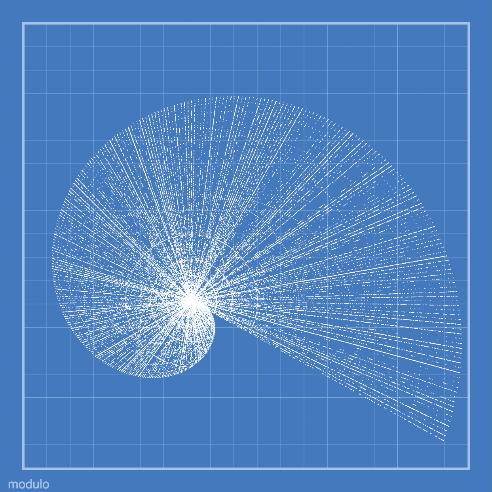

Today is the start of my journal. The goal is to be able to look back on these few months and reflect.

## Haiku
<blockquote class="haiku">
hello my dear friend 
you are ablaze – radiant 
in the sea of sky
</blockquote>

## Mathober p5.js Sketch
I had fun creating [this sketch](https://codepen.io/fractalkitty/pen/abeYVGK) of the Pisano Periods. Each degree is the divisor with dots along the radii for the remainder found.

I love the arcs that emerge in the noise of the pattern. I hope to explore this more in the future.
I also updated my [fractal kitty](https://fractalkitty.com/2024/10/01/mathober-2024-sketches/) site with the sketch.

## 11ty

I plan to use this blog as a place to organize my thoughts and projects as I take a period of growth.

I started with a [template](https://github.com/11ty/eleventy-base-blog) and started messing around with posts, styles and layouts. I am excited to see where this goes. I am hoping to find a way to safely move my Fractal Kitty blog off of Wordpress.

## Zed IDE

I also tried using Zed IDE for the first time. I hope to play around with it more and see if it is a good fit for my workflow - specifically collaboration. I found myself going back to Nova a few times.

## Gratitude
- Yellow ginkgo leaves
- Fluffy western squirrels romping
- Kicking acorns
- Crows chasing hawks as I play

## Other activities
- 3.2 miles walk
- Strength
- Coffee with a friend
- Banjo - reviewing repertoire
- A scrabble game lost by 1 point
- yoga

## Reading
- "To Be Taught if Fortunate" by Becky Chambers
