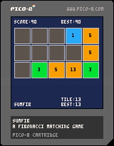
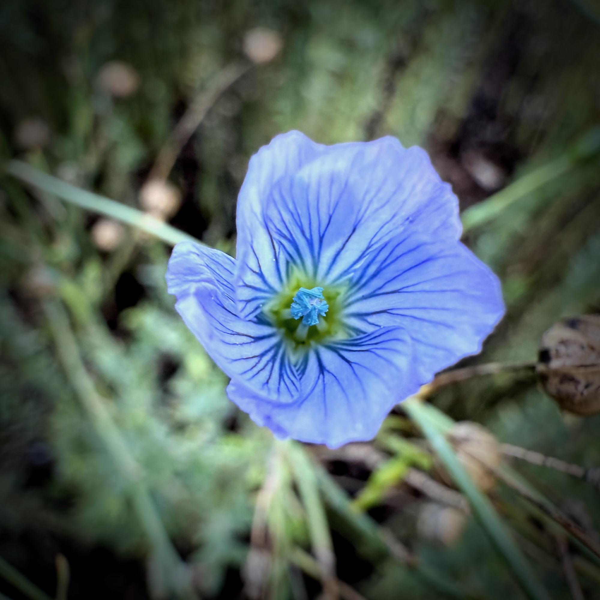

Today's log:

## Haiku
<blockquote class="haiku">
clouds flow in a stream 
of sky and of water - flow 
estuaries to earth
</blockquote>

<!--  -->

## Mathober p5.js Sketch
Commutative gradient play for <a href= "https://codepen.io/fractalkitty/pen/wvVjzwW" target="_blank" rel="noopener noreferrer">this sketch.</a> It took me a few minutes to decided what to do, but I love how color values look so different based on what is next to them. Only one day left for Mathober!

## Pico-8

I was very recently introduced to Pico-8 and thought I'd play around with getting sumfib on it. No sound today, but it seems to work as a draft.

<a href="https://www.lexaloffle.com/bbs/?tid=145020" target="_blank" rel="noopener noreferrer">You can play it here.</a>

On Github <a href="https://github.com/fractalkitty/sumfib_pico8" target="_blank" rel="noopener noreferrer">here.</a>

## 11ty
I figured out how to embed and audio file but don't fully understand how photos and files are copied to _site for the build. It feels like my JS file might not be quite right.

## Obsidian vs. Notion
I feel like I want to love obsidian, but yet finding it hard to get my groove with it. It's nice, but it feels a little cumbersome and slows down my mental flow. I hope to work out a system that works soon.

## Gratitude
- My flax is still blooming!

## Other activities
- knitting a hat
- Yamma board game with kiddo
- Coffee with a friend
- 9 mile cycle
- Strength
- yoga
- played piano for my budgies

<audio controls preload="metadata">
		<source src="puddle-of-stars.m4a" type="audio/mp4">
		Your browser does not support the audio element.
</audio>

## Reading
- "To Be Taught if Fortunate" by Becky Chambers

