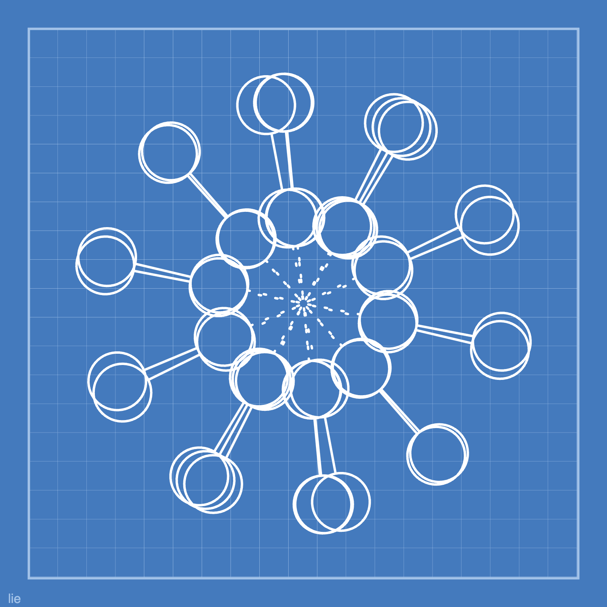

Today's log:

## Haiku
<blockquote class="haiku">
you were warm and loved 
when you passed - now remembered 
a light among trees
</blockquote>

## Mathober p5.js Sketch
Just some rotating dynkin diagrams.  <a href= "hhttps://codepen.io/fractalkitty/pen/WNVJBLP" target="_blank" rel="noopener noreferrer"> Code is here.</a>

## Polyhedra Library

I played with a mathober sketch to make more polyhedra - do we need a p5js library? There is a start of one in this.

	<iframe
		src="https://openprocessing.org/sketch/2424208/embed/?plusEmbedHash=7be44192&userID=281109&plusEmbedTitle=true&show=sketch"
		class="responsive-iframe"
		title="Your iframe title"
		loading="lazy"
		allow="accelerometer; autoplay; clipboard-write; encrypted-media; gyroscope; picture-in-picture"
		allowfullscreen>
	</iframe>

## Gratitude
- Budgies on the keyboard

## Other activities
- pairing with a friend to break their stuff

## Reading
- "To Be Taught if Fortunate" by Becky Chambers

