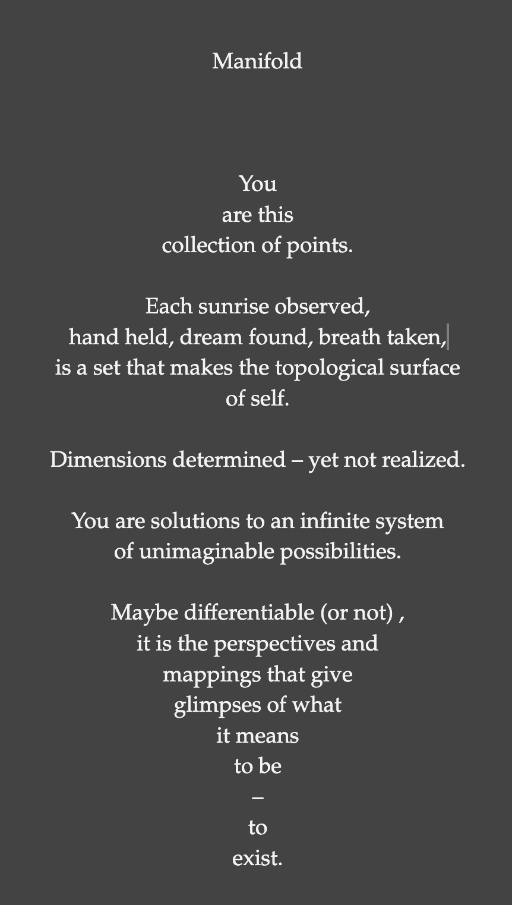

I started with a couple of manifold poems, and then did the non-sitting things.

## Writing

I joined the Willamette Writers for a write in and warmed up with a poem:



And then I made a coded poem:

## A Coded Poem

<section class="sketch-container">
		<h1>Manifold</h1>
		<div id="sketch"></div>
</section>
<script src="https://cdn.jsdelivr.net/npm/p5@1.9.2/lib/p5.min.js"></script>
<script src="./manifold.js"></script>

The poem is in the comments ( <a href= "https://codepen.io/fractalkitty/pen/wvVXWyL" target="_blank" rel="noopener noreferrer"> View on codepen.</a>)

```js
let points = []; //you start as an empty set
let sigma, rho, beta; //with a faint idea of structure
function setup() {
	//and a canvas to be projected upon
	cnv = createCanvas((w = min(windowWidth, windowHeight) * 0.9), w);
	//and so you begin
	for (let i = 0; i < 5000; i++) {
		points[i] = {
			x: randomGaussian(0, w / 6),
			y: randomGaussian(0, w / 6),
			z: randomGaussian(0, w / 6),
		};
	}
	//and your uniqueness begins
	sigma = random(5, 15);
	rho = random(15, 40);
	beta = random(8 / 3, 20 / 3);
	//with a softness
	noStroke();
}

function draw() {
	//with an origin
	translate(w / 2, w / 2);
	//and with time
	t = frameCount / 100;
	//and rotation
	rotate(t / 5);
	//and for each point of self
	for (let i = 0; i < points.length; i++) {
		//there is a separate change in time
		let dt = random(0.00001, 0.0002);
		//and in space
		let dx = sigma * (points[i].y - points[i].x) * dt;
		let dy = (points[i].x * (rho - points[i].z) - points[i].y) * dt;
		let dz = (points[i].x * points[i].y - beta * points[i].z) * dt;
		//that becomes part of your solution
		points[i].x += dx;
		points[i].y += dy;
		points[i].z += dz;
		push();
		//with an ever-changing perspective
		x = points[i].x * sin(t / 2) + points[i].z * cos(t / 2);
		y = points[i].y * sin(t / 2) + points[i].x * cos(t / 2);
		//with an ever-changing color
		fill(
			50 + 50 * sin(points[i].x / 90 - t),
			150 + 100 * sin(points[i].y / 90 - t),
			200 + 100 * sin(points[i].z / 90 + t / 2),
			10
		);
		//you are painted
		circle(x, y, 5);
		//and realized
		fill(255, 255, 255, 120);
		circle(x, y, 1);
		pop();
	}
	//and with new inputs
	for (let i = 0; i < 20; i++) {
		//you evolve
		points.shift();
		points.push({
			x: randomGaussian(0, w / 5),
			y: randomGaussian(0, w / 5),
			z: randomGaussian(0, w / 5),
		});
	}
	push();
	rotate(-t / 5);
	noFill();
	stroke(255);
	//to be framed in time
	rect(-w / 2 + w / 20, -w / 2 + w / 20, w - w / 10, w - w / 10);
	pop();
	//manifold
}

function keyPressed() {
	if (keyCode === 83) {
		save(cnv, "manifold", "png");
	}
	if (keyCode === 32) {
		setup();
		draw();
	}
	console.log(points.length);
}

function windowResized() {
	resizeCanvas((w = min(windowWidth, windowHeight) * 0.9), w);
}
```

## 11ty

Well, this week I figured out how to do some embeds, show code with syntax highlighting, and get audio working. I am still having issues with my config file and have had to manually fix some files in the \_site folder that will most likely bite me in the future. Overall - it's starting to feel better.

## Gratitude

- morning crows
- coffee

## Other activities

- strength
- yoga
- knitting a hat

## Reading

- "To Be Taught if Fortunate" by Becky Chambers

  I am almost done and am game for recommendations. I just finished the 4 books of Hyperion before this - so maybe one more light read.
